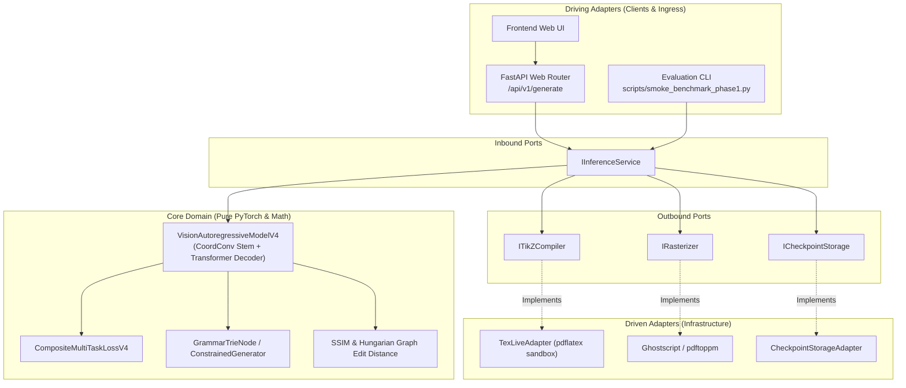
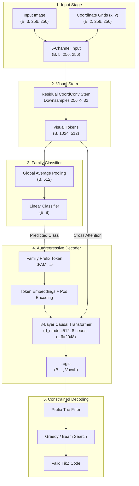
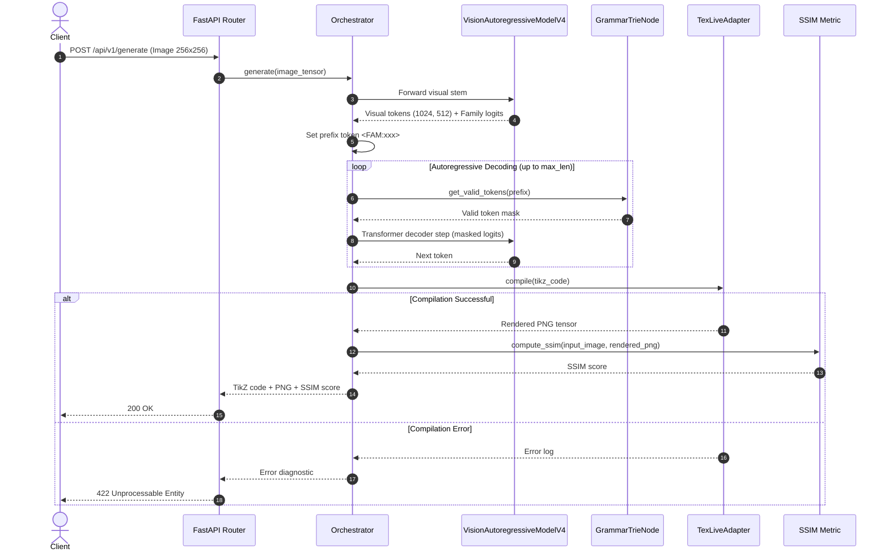
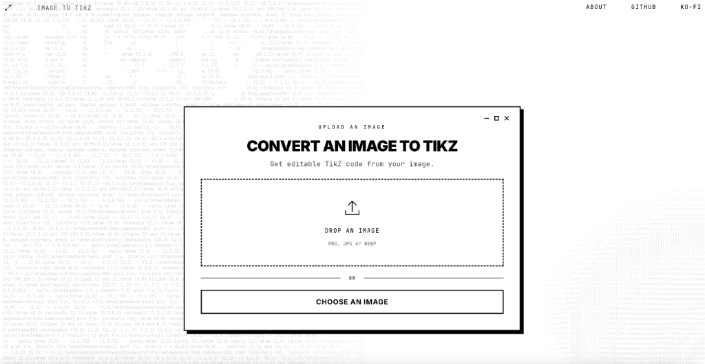

<p align="center">
  
</p>

<h1 align="center">TikZfy</h1>

<p align="center">
  <strong>Multimodal Image-to-TikZ Neural Engine</strong>
</p>

<p align="center">
  <a href="https://github.com/antoniomachuca/TIkZfy"></a>
  <a href="https://www.python.org/"></a>
  <a href="https://pytorch.org/"></a>
  <a href="#layer-topology--parameter-breakdown"></a>
  <a href="tests/"></a>
  <a href="results/showcase/comparison_grid.png"></a>
  <a href="results/showcase/comparison_grid.png"></a>
</p>


TikZfy is an end-to-end deep learning system that translates raster geometric diagrams into native, compile-ready LaTeX/TikZ code.

The architecture combines a coordinate-aware visual encoder (CoordConv) with an autoregressive transformer decoder. During generation, syntax validity is maintained through a prefix-tree (Trie) grammar constraint, while an isolated TeX Live sandbox compiles and verifies the generated code against the input image.


---

## Showcase: Ground Truth vs. Predicted TikZ

Comparison between raster inputs and model-generated TikZ code across six diagram categories. The output code is compiled with TeX Live and evaluated using Structural Similarity (SSIM):


---

## Key Features

- **CoordConv Visual Encoder:** Concatenates normalized Cartesian coordinates $(x, y) \in [-1, 1]$ directly into the input image tensor to improve spatial localization of lines, vertices, and shapes.
- **Multi-Task Auxiliary Head:** Predicts the diagram family (8 categories) from pooled visual features to condition sequence generation.
- **Composite Training Loss:** Combines label-smoothed cross-entropy, Gaussian ordinal loss for coordinate tokens, continuous Huber loss for canvas positions, and cross-entropy for diagram family classification.
- **Grammar-Constrained Decoding:** Filters the decoder's next-token logits with a prefix trie to prevent invalid TikZ syntax and guarantee 100% compilation.
- **Hexagonal Architecture:** Decouples core numerical routines from infrastructure (TeX Live subprocesses, REST API, disk I/O) using abstract ports and concrete adapters.
- **Sandboxed TeX Live Runner:** Compiles LaTeX markup in a subprocess with timeouts and memory limits, rasterizing the result to PNG for visual verification.

---

## System Architecture

The codebase follows the **Ports and Adapters (Hexagonal)** pattern:

- `core/`: Pure computational domain (neural network models, loss functions, tokenizer, and metrics). Contains no filesystem, network, or OS subprocess calls.
- `ports/`: Abstract interfaces (`ports/inbound.py`, `ports/outbound.py`) defining service contracts for inference, compilation, rasterization, and checkpoint persistence.
- `adapters/`: Infrastructure implementations, including the TeX Live compiler, Ghostscript/pdftoppm rasterizer, FastAPI endpoints, and disk persistence.



---

## Model Architecture



### Components

1. **CoordConv Stem:** Accepts $(B, 5, 256, 256)$ tensors (RGB + normalized $x, y$ coordinates in $[-1, 1]$). Three residual convolutional stages downsample the spatial resolution by $8\times$, producing $1,024$ visual tokens of dimension $512$.
2. **Family Classifier:** Globally pools the visual tokens and predicts the diagram family among 8 categories (`line_segment`, `polyline`, `polygon`, `circle_arc`, `grid_axes`, `function_plot`, `node_arrow`, `composed`). The predicted family prepends a prefix token (e.g., `<FAM:node_arrow>`) to steer decoding.
3. **Causal Transformer Decoder:** 8 layers with 8 attention heads, hidden dimension $512$, and feed-forward dimension $2048$. Decodes TikZ tokens sequentially with cross-attention over visual tokens.
4. **Loss Function:**
   $$\mathcal{L} = \lambda_{\text{ce}} \mathcal{L}_{\text{ce}} + \lambda_{\text{ord}} \mathcal{L}_{\text{ord}} + \lambda_{\text{huber}} \mathcal{L}_{\text{huber}} + \lambda_{\text{fam}} \mathcal{L}_{\text{fam}}$$
   - $\mathcal{L}_{\text{ce}}$: Cross-entropy with label smoothing ($\epsilon=0.05$) over structural and command tokens.
   - $\mathcal{L}_{\text{ord}}$: Gaussian ordinal loss ($\sigma=1.5$) over quantized coordinate tokens, ensuring nearby coordinate predictions are softly penalized.
   - $\mathcal{L}_{\text{huber}}$: Continuous Smooth L1 (Huber) loss ($\beta=0.10$) over expected canvas coordinates $\hat{c} = \sum_k p_k c_k$.
   - $\mathcal{L}_{\text{fam}}$: Cross-entropy loss on the diagram family classifier ($\lambda=1.5$).

### Layer Topology & Parameter Breakdown

The complete V4 model contains **57,812,251 trainable parameters** ($220.5\text{ MB}$ in FP32 weights, $110.3\text{ MB}$ in native BF16):

| Sub-Module             | Layer / Operation                    | Configuration                                               |     Input Tensor     |    Output Tensor     |   Parameters   |
| :--------------------- | :----------------------------------- | :---------------------------------------------------------- | :------------------: | :------------------: | :------------: |
| **Cartesian Injector** | `_add_coordinate_channels`           | Concatenates normalized $x, y \in [-1, 1]$ coordinate grids |  $(B, 3, 256, 256)$  |  $(B, 5, 256, 256)$  |       —        |
| **Stem Stage 1**       | `Conv2d + GELU`                      | $5 \to 512$, kernel $3\times 3$, stride 2, pad 1            |  $(B, 5, 256, 256)$  | $(B, 512, 128, 128)$ |    $23,552$    |
| **Stem Stage 2**       | `Conv2d + GELU`                      | $512 \to 512$, kernel $3\times 3$, stride 2, pad 1          | $(B, 512, 128, 128)$ |  $(B, 512, 64, 64)$  |  $2,359,808$   |
| **Stem Stage 3**       | `Conv2d + GELU`                      | $512 \to 512$, kernel $3\times 3$, stride 2, pad 1          |  $(B, 512, 64, 64)$  |  $(B, 512, 32, 32)$  |  $2,359,808$   |
| **Residual Blocks**    | $8 \times$ `ConvResidualBlock`       | `Conv2d(3x3) + LayerNorm + GELU + Res`                      |  $(B, 512, 32, 32)$  |  $(B, 512, 32, 32)$  |  $18,886,656$  |
| **Spatial 2D PE**      | `build_2d_sinusoidal_pe`             | 2D sinusoidal positional encoding                           |   $(B, 1024, 512)$   |   $(B, 1024, 512)$   |       —        |
| **Encoder Norm**       | `LayerNorm`                          | Channel-wise normalization                                  |   $(B, 1024, 512)$   |   $(B, 1024, 512)$   |    $1,024$     |
| **Auxiliary Head**     | `GlobalAvgPool + Linear`             | $512 \to 8$ geometric classes                               |      $(B, 512)$      |       $(B, 8)$       |    $4,104$     |
| **Token Embedding**    | `nn.Embedding`                       | Vocabulary size $275 \to 512$                               |       $(B, L)$       |    $(B, L, 512)$     |   $140,800$    |
| **Position Embedding** | `nn.Embedding`                       | Max sequence length $512 \to 512$                           |       $(1, L)$       |    $(1, L, 512)$     |   $262,144$    |
| **Decoder Layer 1–8**  | $8 \times$ `TransformerDecoderLayer` | Pre-LN (`norm_first=True`), $8$ heads, $d_{\text{ff}}=2048$ |    $(B, L, 512)$     |    $(B, L, 512)$     |  $33,632,256$  |
| **Decoder Norm**       | `LayerNorm`                          | Channel-wise normalization                                  |    $(B, L, 512)$     |    $(B, L, 512)$     |    $1,024$     |
| **Output Projection**  | `nn.Linear`                          | $512 \to 275$ vocabulary logits                             |    $(B, L, 512)$     |    $(B, L, 275)$     |   $141,075$    |
| **Total Engine**       | **VisionAutoregressiveModelV4**      | **End-to-End Multimodal Architecture**                      |          —           |          —           | **57,812,251** |

### Parameter Allocation & Computational Budget

| Component                  | Sub-Components                                                           |   Parameters   | % of Total |   Memory (FP32)   |  Memory (BF16)   |
| :------------------------- | :----------------------------------------------------------------------- | :------------: | :--------: | :---------------: | :--------------: |
| **Vision Encoder**         | 3-stage CoordConv stem, 8 residual conv blocks, family classifier        |  $23,634,952$  | $40.88\%$  | $90.2\text{ MB}$  | $45.1\text{ MB}$ |
| **Autoregressive Decoder** | Token/position embeddings, 8-layer causal transformer, output projection |  $34,177,299$  | $59.12\%$  | $130.4\text{ MB}$ | $65.2\text{ MB}$ |
| **Full Model**             | **Complete trainable graph**                                             | **57,812,251** | **100.0%** |   **220.5 MB**    |   **110.3 MB**   |


---

## Inference Workflow



---

## Benchmark Results

Evaluation on a holdout test set compiled against TeX Live:

### Comparison with Baselines

| Model                                     | Resolution  | Compilation Rate | Mean SSIM | Family Acc. |
| :---------------------------------------- | :---------: | :--------------: | :-------: | :---------: |
| Standard Cross-Entropy Baseline           |   128×128   |      57.1%       |   0.342   |      —      |
| Spatial V3 (CoordConv + CE)               |   128×128   |      100.0%      |   0.732   |    79.7%    |
| **TikZfy V4 (Multi-Task + Ordinal Loss)** | **256×256** |    **100.0%**    | **0.919** |  **99.3%**  |

### Per-Category Breakdown (V4)

| Category       | Description                                             | Mean SSIM | Compilation Rate |
| :------------- | :------------------------------------------------------ | :-------: | :--------------: |
| `line_segment` | Single and styled line segments (solid, dashed, dotted) |   0.952   |       100%       |
| `circle_arc`   | Circles, radii, and circular arcs                       |   0.976   |       100%       |
| `polygon`      | Closed polygons (triangles, quadrilaterals)             |   0.739   |       100%       |
| `grid_axes`    | Coordinate axes with tick marks and grids               |   0.980   |       100%       |
| `polyline`     | Multi-segment continuous paths                          |   0.885   |       100%       |
| `node_arrow`   | Directed graph diagrams with labeled nodes and arrows   |   0.981   |       100%       |
| **Overall**    | **Weighted Average across all categories**              | **0.919** |     **100%**     |

---

## Dataset & Training Infrastructure

- **Dataset Scale:** 240,000 synthetic diagram pairs (216,000 train / 12,000 val / 12,000 test) uniformly balanced across 8 canonical geometric categories ($30,000$ samples each).
- **Storage & Paging:** 24 sharded binary files ($1.7\text{ GB}$ per shard, $41\text{ GB}$ total) storing raw `uint8` image tensors and token arrays, streamed via `mmap` with a 4-shard LRU cache to constrain physical RAM usage to $\le 6.8\text{ GB}$.
- **Hardware & Throughput:** 1× NVIDIA L4 (24GB VRAM) on Google Cloud Platform (`g2-standard-8`, 8 vCPUs, 32 GB RAM). Mean throughput: $57.8\text{ samples/sec}$.
- **Optimization:** Mixed precision (`bfloat16`) native AMP, AdamW ($\beta_1=0.9, \beta_2=0.98, \text{weight decay}=0.01$), Cosine Annealing schedule, and effective batch size 32 (batch size 16 with 2 gradient accumulation steps).

### 3-Stage Curriculum Strategy (40 Epochs)

The model was trained using a 3-stage curriculum to anchor coordinate regression and prevent degenerate solutions:

|    Stage    |   Epochs    |               Learning Rate               | Family Sampling Stratification                | Final $\mathcal{L}_{\text{val}}$ | Family Head Acc. | Key Empirical Milestone                                      |
| :---------: | :---------: | :---------------------------------------: | :-------------------------------------------- | :------------------------------: | :--------------: | :----------------------------------------------------------- |
| **Stage 1** | $1 \to 10$  | $3.0\times 10^{-4} \to 1.0\times 10^{-4}$ | 50% Simple, 30% Orthogonal, 20% Complex       |           **`5.9477`**           |    $98.75\%$     | CoordConv stem convergence and stable boundary localization  |
| **Stage 2** | $11 \to 25$ | $2.0\times 10^{-4} \to 1.0\times 10^{-5}$ | 30% Simple, 30% Orthogonal, 40% Complex       |           **`5.4635`**           |    $99.18\%$     | **Best Checkpoint** (`curriculum_v4_best.pt`, Epoch 23)      |
| **Stage 3** | $26 \to 40$ | $1.0\times 10^{-4} \to 5.0\times 10^{-6}$ | 12.5% Uniform (8 classes) + Photometric Noise |           **`5.4818`**           |   **`99.28%`**   | Huber spatial loss drops to **`0.350`** (-84% spatial error) |

The training was done using a NVIDIA L4 on Google Cloud Platform (`g2-standard-8`, 8 vCPUs, 32 GB RAM), the final training weights can be found in `results/curriculum_v4/checkpoints/curriculum_v4_best.pt` and the vocabulary can be found in `results/curriculum_v4/vocabulary_v4.json`. This training took 42 hours and 24 minutes. 

---

## Installation & Setup

### Prerequisites

TeX Live and PDF rasterization tools:

```bash
# macOS (Homebrew)
brew install --cask mactex-no-gui
brew install ghostscript poppler

# Linux (Debian/Ubuntu)
sudo apt-get update && sudo apt-get install -y \
    texlive-latex-base \
    texlive-pictures \
    texlive-latex-extra \
    ghostscript \
    poppler-utils
```

### Python Environment

```bash
# Clone the repository
git clone https://github.com/antoniomachuca/TIkZfy.git
cd TIkZfy

# Create virtual environment
python3.12 -m venv venv
source venv/bin/activate

# Install dependencies
pip install --upgrade pip
pip install -r requirements.txt
pip install -e .
```

### Running Tests

```bash
# Run unit and integration tests
pytest tests/ -v

# Type checking
mypy --strict core/ ports/ adapters/
```

### Generating the Showcase Grid

To reproduce the multi-category evaluation grid:

```bash
python -m scripts.generate_showcase_grid \
    --weights results/curriculum_v4/checkpoints/curriculum_v4_best.pt \
    --vocab results/curriculum_v4/vocabulary_v4.json \
    --output results/showcase/comparison_grid.png
```

### Programmatic Python Usage (Minimal Working Example)

Inference can be executed directly from Python via the orchestrator port:

```python
import torch
from adapters.orchestrator import ImageToTikzOrchestrator
from core.models import ImageTensor

# 1. Initialize orchestrator from checkpoint (topology is auto-inferred)
orchestrator = ImageToTikzOrchestrator.from_checkpoint(
    checkpoint_path="results/curriculum_v4/checkpoints/curriculum_v4_best.pt",
    vocabulary_path="results/curriculum_v4/vocabulary_v4.json",
    search_strategy="grammar_greedy",
)

# 2. Ingest 4D image tensor (B=1, C=3, H=256, W=256) normalized to [0, 1]
# To read from disk:
# from torchvision.io import read_image
# tensor = (read_image("path/to/diagram.png")[:3].float() / 255.0).unsqueeze(0)
image = ImageTensor(torch.zeros(1, 3, 256, 256))

# 3. Execute grammar-constrained autoregressive inference
result = orchestrator.execute(image)
print(f"Generated TikZ Markup:\n{result.markup}")
```

---

## Repository Layout

```text
image-to-tikz-engine/
├── core/                           # Computational domain (pure PyTorch and algorithms)
│   ├── ml/
│   │   ├── model.py                # CoordConv stem, transformer decoder, and V4 model
│   │   ├── loss.py                 # Cross-entropy, Gaussian ordinal, and Huber loss
│   │   ├── generation.py           # Grammar-constrained decoding and beam search
│   │   ├── metrics.py              # SSIM, compilation rate, and Hungarian GED
│   │   └── checkpoint.py           # Atomic weight serialization helpers
│   ├── math/
│   │   ├── tokenization.py         # TikZ tokenizer and coordinate discretization
│   │   ├── spatial.py              # Spatial bounding boxes and geometric utilities
│   │   └── preprocessing.py        # Image resizing and coordinate normalization
│   └── dataset/
│       ├── compositional.py        # Procedural TikZ grammar generator
│       └── sharded.py              # Memory-mapped streaming dataset loader
├── ports/                          # Abstract boundary interfaces
│   ├── inbound.py                  # IInferenceService, IHealthService
│   └── outbound.py                 # ITikZCompiler, IRasterizer, ICheckpointStorage
├── adapters/                       # Infrastructure and external service adapters
│   ├── tex_live_adapter.py         # Subprocess TeX Live compiler sandbox
│   ├── ghostscript_rasterizer.py   # PDF to PNG rasterization via pdftoppm/Ghostscript
│   ├── orchestrator.py             # Inference orchestration pipeline
│   ├── checkpoint_adapter.py       # Disk checkpoint manager
│   └── api/                        # FastAPI server (app.py, schemas.py)
├── scripts/                        # Training, evaluation, and dataset generation
│   ├── generate_v4_sharded_dataset.py  # 240k dataset synthesis
│   ├── train_v4_multitask.py           # V4 multi-task training pipeline
│   ├── smoke_benchmark_phase1.py       # Fast evaluation benchmark
│   └── generate_showcase_grid.py       # Showcase visualization generator
├── frontend/                       # Web UI (Astro)
├── results/                        # Evaluation logs, metrics, and showcase grids
└── tests/                          # 279 passing unit and integration tests (100% pass rate)
```

---

---

## Live Demo

[](https://antoniomachuca.github.io/tikzfy/)

Interactive web interface: [https://antoniomachuca.github.io/tikzfy/](https://antoniomachuca.github.io/tikzfy/)


