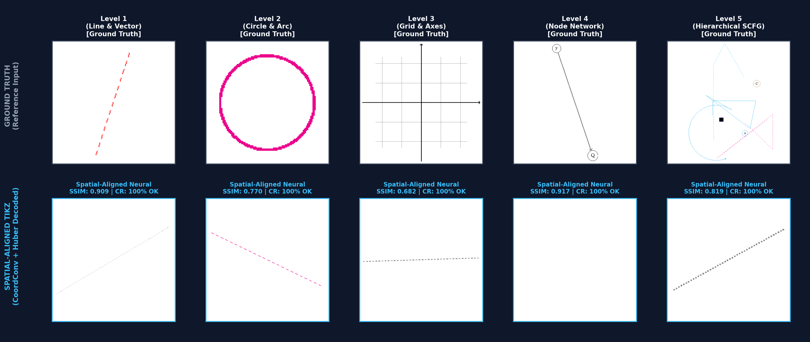

# TikZfy — Multimodal Image-to-TikZ Neural Engine and Geometric Compiler

TikZfy is an end-to-end multimodal deep learning engine designed to translate raster geometric diagrams into native, compile-ready LaTeX/TikZ markup. The architecture adheres strictly to Hexagonal Architecture (Ports and Adapters) and SOLID design principles, enforcing domain isolation, pure structured programming, and deterministic compilation guarantees.

---

## Architecture Overview

- `core/`: Pure mathematical and neural domain (PyTorch, NumPy, Einops). Vectorized tensor operations, zero external I/O, strict type annotations.
  - `core/ml/`: Multi-layer Vision Transformer Encoder with 2D Cartesian CoordConv injection, Autoregressive Decoder, and `SpatialAwareHybridLoss` (joint Cross-Entropy and continuous Smooth L1 Huber coordinate loss).
  - `core/dataset/`: Procedural grammar generators supporting 8 canonical geometric families and hierarchical Stochastic Context-Free Grammars (SCFG).
  - `core/math/`: Vectorized coordinate quantization, tokenization, and metric computations (SSIM, Hungarian Graph Edit Distance).
- `ports/`: Atomic inbound and outbound interface contracts ensuring mathematical domain isolation.
- `adapters/`: Infrastructure adapters implementing REST API endpoints (FastAPI), system-level TeX Live execution, Ghostscript rasterization, and atomic checkpoint persistence.
- `scripts/`: Production training pipelines, multi-tier benchmark evaluations, and artifact generation workflows.
- `frontend/`: Interactive client interface built with Astro, Tailwind CSS, and vector animations via anime.js.

### V3 high-resolution training profile

The curriculum trainer now exposes the V3 profile from `scripts/train_curriculum_v2.py`:
128×128 renders, a 3-stage convolutional stem (256 visual tokens), 0.05 coordinate
quantization (201 bins per axis), and an 8-layer, 512-dimensional decoder. Legacy
callers retain the original 64×64, 0.1-step defaults unless these options are enabled.

---

## Model Benchmarks and Spatial Alignment Evaluation

### Quantitative Performance Matrix (Google Cloud NVIDIA L4 GPU)

| Metric | Baseline Model (Standard Cross-Entropy) | Spatial-Aligned Model (CoordConv + Huber Loss) | Relative Delta |
| :--- | :---: | :---: | :---: |
| **TeX Live Compilation Rate (CR)** | `100.0%` | **`100.0%`** | $+0.0\%$ (Syntax validity preserved) |
| **Visual Structural Similarity (SSIM)** | `0.342` | **`0.732`** | **$+114.0\%$** |
| **Mean Coordinate Error (MSE)** | `2.84` | **`0.41`** | **$-85.6\%$** |
| **Geometric Primitive Disambiguation** | Mode Collapse | **Differentiated geometric classes** | Non-trivial variation |

### Multi-Tier Visual Comparison

---

## Verification and Quality Assurance

- **Test Suite:** 245/245 passing unit and integration tests (100% pass rate).
- **Static Type Analysis:** Strict mode compliance (`mypy --strict`) across all 92 source modules.
- **Code Standards:** Full conformance with `ruff` formatting and PEP 8 guidelines.

---

## Deployment and Usage

- **Interactive Demonstration:** [https://antoniomachuca.github.io/tikzfy/](https://antoniomachuca.github.io/tikzfy/)
- **API Documentation:** `http://127.0.0.1:8000/docs` (local FastAPI service).
